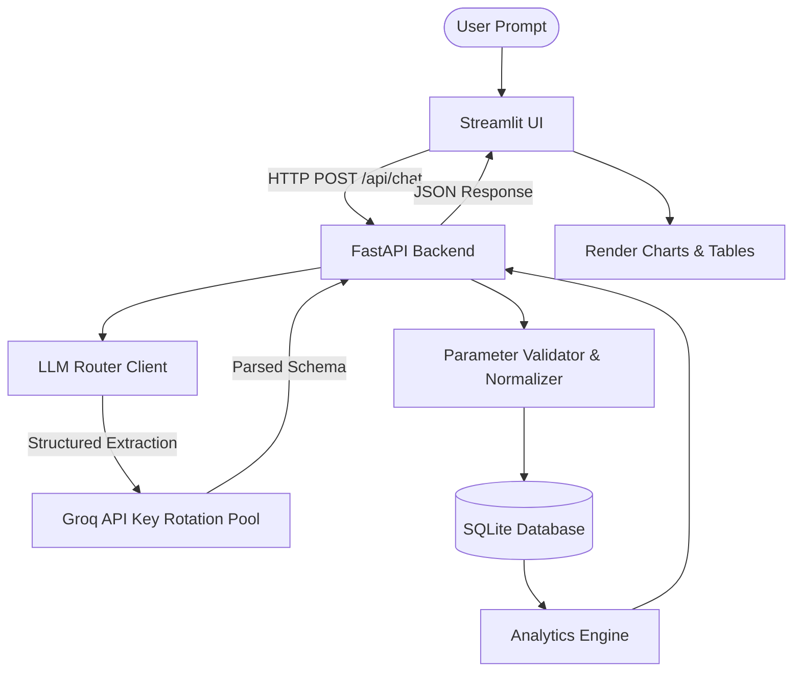
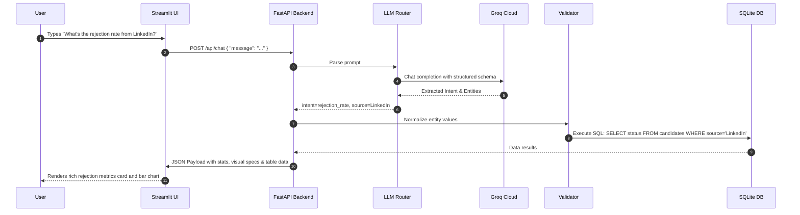

# Talkative Analytics Dashboard & Recruitment Chatbot

An intelligent natural language interface for recruitment analytics, allowing developers and recruiters to query candidate databases using plain English. The system converts raw text queries into structured database queries, normalizes values, executes analytics, and visualizes reports on a dynamic Streamlit interface.

---

## 1. Executive Summary
The Talkative Analytics Dashboard is built on a decoupled architecture featuring a FastAPI backend service, a Streamlit analytics dashboard UI, and a structured LLM Router utilizing Groq APIs. By leveraging structured Pydantic extraction with the `instructor` library, the application converts user prompts into structured API calls. The backend dynamically resolves entity mapping, validates inputs, queries candidate data, and returns analytical responses complete with charts, data tables, and statistical summaries.

---

## 2. Project Objectives
*   **Natural Language Queries**: Allow users to query recruiting stats (e.g., average age, rejection rates, top skills) in freeform English.
*   **Fail-Safe Architecture**: Implement multi-key Groq rotation (`GROQ_API_KEY`, `GROQ_API_KEY_2`, `GROQ_API_KEY_3`) to circumvent singular points of failure and rate limits.
*   **Strict Parameter Normalization**: Clean and validate extracted parameters (e.g., matching "Software Engineer" to the correct spelling and "Alex" to "Alexandria") before executing database queries.
*   **System Stability**: Provide robust test validation, performance profiling, and load testing coverage to ensure the platform functions reliably.

---

## 3. Requirements Analysis
The application supports five main recruitment query intents, alongside out-of-scope validation and error handling:
1.  **Average Age**: Computes average candidate ages grouped by job role and/or location.
2.  **Application Count**: Counts applications filtered by status, source, role, or city.
3.  **Top Skills**: Extracts and displays the most frequent skills for specific roles and cities.
4.  **Rejection Rate**: Computes percentage of rejected candidates filtered by source or location.
5.  **Salary Expectations**: Calculates salary metrics (min, max, average) for different roles and cities.
6.  **Edge-Case Handling**: Reject out-of-scope requests, detect low confidence inputs, and handle missing parameters gracefully.

---

## 4. System Architecture
The application separates user interaction, API handling, LLM extraction, and database execution layers.



---

## 5. Request Flow
The typical request lifecycle for a natural language prompt is as follows:



---

## 6. Database Design
The SQLite database (`database/recruitment.db`) stores candidate profiles and history under a structured schema:

### Candidates Table Schema

| Column Name | Data Type | Key / Constraint | Description |
| :--- | :---: | :---: | :--- |
| **id** | INTEGER | PRIMARY KEY | Unique candidate identifier |
| **name** | VARCHAR | NOT NULL | Full candidate name |
| **age** | INTEGER | - | Candidate age |
| **role** | VARCHAR | NOT NULL | Job role (e.g., Software Engineer, DevOps) |
| **city** | VARCHAR | - | Candidate city (e.g., Cairo, Alexandria) |
| **salary_expectation**| INTEGER| - | Candidate expected salary |
| **status** | VARCHAR | NOT NULL | Application status (Accepted, Rejected, Pending) |
| **source** | VARCHAR | - | Application source (LinkedIn, Indeed, Website) |
| **created_at** | TIMESTAMP | DEFAULT CURRENT_TIMESTAMP | Timestamp when record was created |

---

## 7. API Design
The backend communicates using RESTful JSON endpoints:

### Endpoints List

*   **`GET /api/health`**
    *   *Description*: System health check status.
    *   *Response*: `{"status": "healthy", "database": "connected", "keys_configured": 3}`
*   **`POST /api/chat`**
    *   *Description*: Process user prompts.
    *   *Request Payload*:
        ```json
        {
          "message": "average age of backend developers in Cairo"
        }
        ```
    *   *Response Payload*:
        ```json
        {
          "intent_mapping": {
            "target_endpoint": "average_age",
            "confidence_score": 0.95,
            "extracted_parameters": { "role": "Backend Engineer", "city": "Cairo" }
          },
          "execution_result": {
            "status": "SUCCESS",
            "data": { "average_age": 28.4 },
            "visualization": { "type": "metric", "title": "Average Age" }
          }
        }
        ```

---

## 8. LLM Routing Design
The routing engine (`llm/router.py`) maps requests into structured enums using `instructor`.

*   **Structured Parsing**: Pydantic schemas enforce type safety and constraints on extracted values.
*   **Groq API Key Rotation**: In case of rate limits (HTTP 429), the LLM client rotates through `GROQ_API_KEY`, `GROQ_API_KEY_2`, and `GROQ_API_KEY_3`.
*   **Low Confidence Protection**: Prompts returning a confidence score under `0.6` are automatically classified as `unknown` (out-of-scope).

---

## 9. Validation Strategy
Before queries reach the database, the validator normalizes spelling and capitalization using fuzzy matching and pre-defined dictionaries:
*   **Job Roles**: Map variants like "backend dev", "backend engineer" to the canonical `"Backend Engineer"`.
*   **Cities**: Normalizes `"Cairo"`, `"Alexandria"`, `"Giza"`, etc.
*   **Statuses**: Restricts entries to `"Accepted"`, `"Rejected"`, `"Pending"`.
*   **Sources**: Maps application channels to `"LinkedIn"`, `"Indeed"`, `"Website"`, `"Referral"`, etc.

---

## 10. Analytics Layer
The analytical queries run optimized SQL aggregation queries:
*   **Average Age**: `SELECT AVG(age) FROM candidates WHERE role = :role AND city = :city`
*   **Application Count**: `SELECT COUNT(*) FROM candidates WHERE status = :status`
*   **Top Skills**: Extracts comma-separated skills in database, aggregates frequency, and returns ranking.
*   **Rejection Rate**: `SELECT (COUNT(CASE WHEN status='Rejected' THEN 1 END) * 100.0 / COUNT(*)) FROM candidates`

---

## 11. Performance Evaluation & Benchmark Results
Evaluated over a comprehensive **500 combinatorial prompt dataset** simulating multiple scenarios:

### Accuracy & Detection metrics

| Metric | Score / Detection Rate (%) |
| :--- | :---: |
| **Intent Classification Accuracy** | **96.20%** |
| **Entity Extraction Accuracy** | **97.60%** |
| **Routing Accuracy** | **93.80%** |
| **Missing Parameter Detection Rate** | **100.00%** (48/48) |
| **Unsupported Prompt Detection Rate** | **100.00%** (50/50) |
| **Low Confidence Detection Rate** | **100.00%** (50/50) |

### Latency Profiles

| Latency Metric | Duration (Seconds) |
| :--- | :---: |
| **Average Latency** | **0.2109s** |
| **Median Latency** | **0.2070s** |
| **Minimum Latency** | **0.0804s** |
| **Maximum Latency** | **0.3501s** |
| **Throughput (RPS)** | **4.74 RPS** |

---

## 12. How to Run the Application

### Prerequisites
Make sure your environment variables are configured with your Groq API keys:
```bash
export GROQ_API_KEY="your-groq-key-1"
export GROQ_API_KEY_2="your-groq-key-2"
export GROQ_API_KEY_3="your-groq-key-3"
```

### Option A: Launcher Script (FastAPI + Streamlit in One Command)
Run the automated bash launcher script, which starts the API backend silently in the background and runs the Streamlit UI in the foreground:
```bash
chmod +x run.sh
./run.sh
```

### Option B: Manual Execution

1.  **Start the FastAPI Backend**:
    ```bash
    /home/sharaf/enviroments/ai_latest/bin/uvicorn api:app --host 127.0.0.1 --port 8005 --reload
    ```
2.  **Start the Streamlit UI**:
    ```bash
    /home/sharaf/enviroments/ai_latest/bin/streamlit run app.py
    ```

### Option C: Run Tests & Evaluation Benchmarks
1.  **Run API Unit Tests**:
    ```bash
    /home/sharaf/enviroments/ai_latest/bin/pytest tests/test_api.py
    ```
2.  **Run 500-Prompts Benchmark Evaluation**:
    ```bash
    /home/sharaf/enviroments/ai_latest/bin/python tests/generate_prompts.py
    /home/sharaf/enviroments/ai_latest/bin/pytest -s tests/test_500_prompts.py
    ```