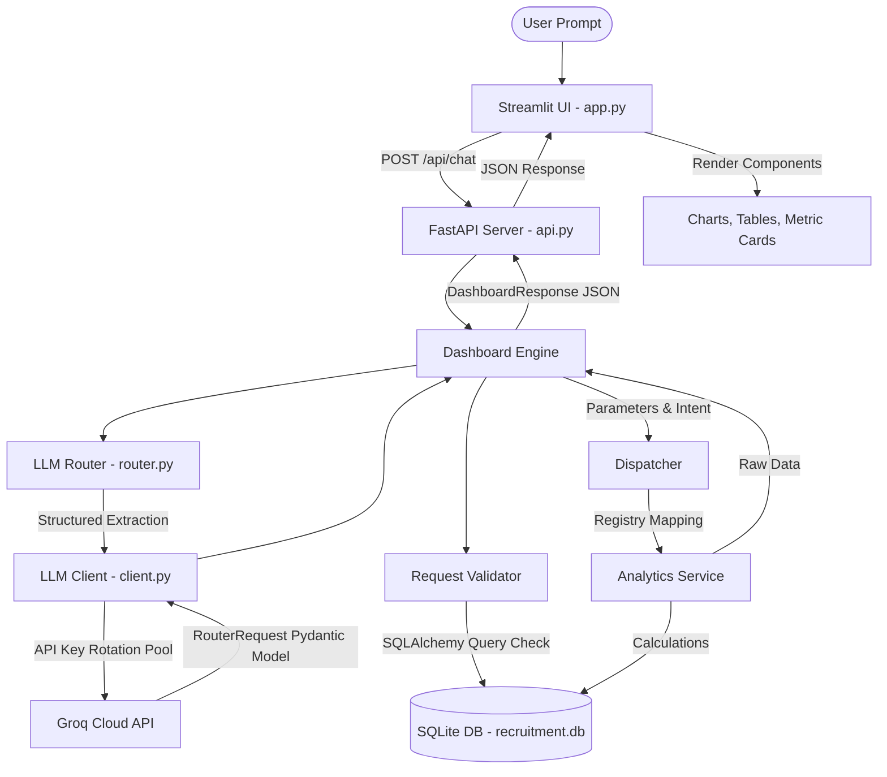
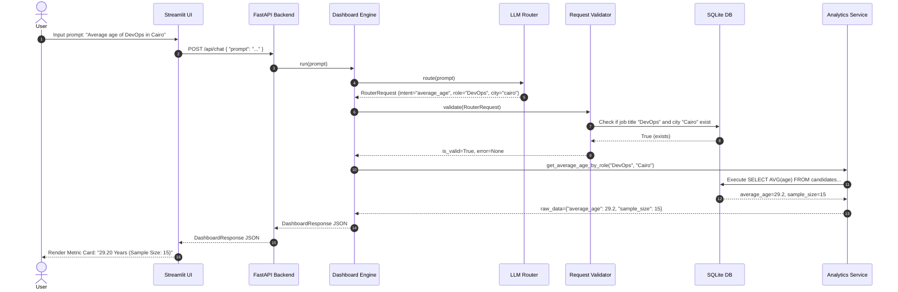
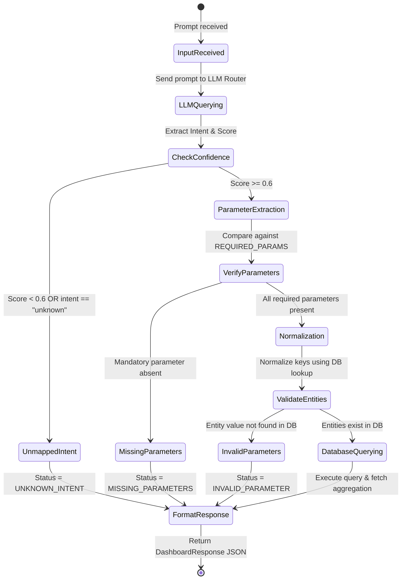
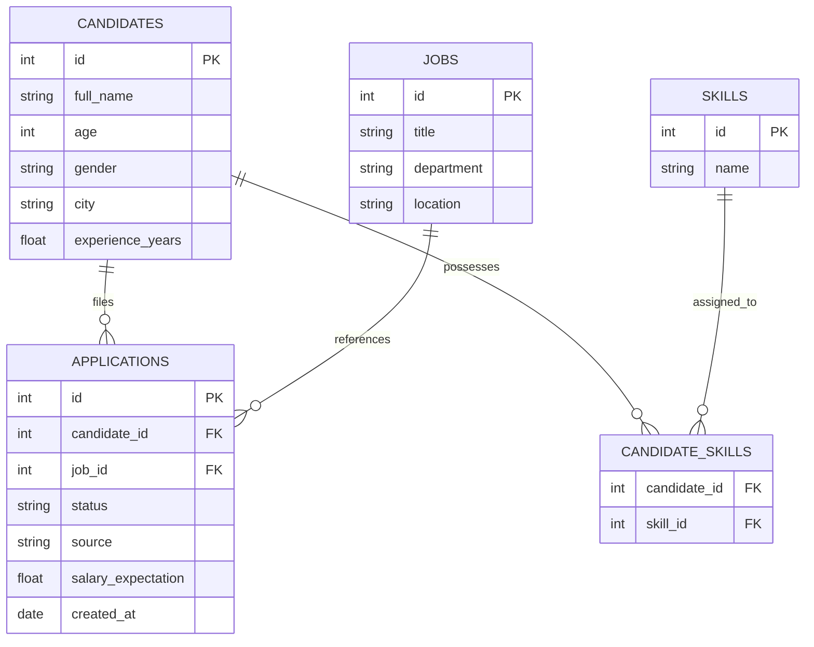

# Software Requirements Specification (SRS)
## For Talkative Analytics Dashboard & Recruitment Chatbot

---

## 1. Introduction

### 1.1 Purpose
This document details the Software Requirements Specification (SRS) for the **Talkative Analytics Dashboard**. It outlines the functional and non-functional requirements, logical design, system architecture, database specifications, use case scenarios, and performance benchmarks for the natural language recruitment query pipeline.

### 1.2 Scope
The Talkative Analytics Dashboard functions as an intelligent, natural language interface on top of a candidate recruitment database. Instead of relying on open-ended conversational LLM generation, which is prone to hallucinations, this system utilizes a structured LLM router to interpret user requests, map them to specific backend analytics queries, and return structured, deterministic results visualized on a Streamlit web interface. 

### 1.3 Definitions, Acronyms, and Abbreviations
*   **LLM**: Large Language Model.
*   **SRS**: Software Requirements Specification.
*   **API**: Application Programming Interface.
*   **JSON**: JavaScript Object Notation.
*   **SQL**: Structured Query Language.
*   **Fuzzy Matching**: A technique to identify strings that match a pattern approximately rather than exactly.
*   **Instructor**: A Python library that wraps OpenAI/Groq clients to enforce structured outputs using Pydantic.

### 1.4 Document Overview
This document is divided into six sections:
1. **Introduction**: Document purpose, scope, and definitions.
2. **Overall Description**: Product perspective, functions, constraints, and assumptions.
3. **System Features & Functional Requirements**: Breakdowns of the core system processes.
4. **Use Case Modeling**: Specific operational scenarios including success paths, missing parameter collections, and error handling.
5. **Non-Functional Requirements**: Specifications for latency, accuracy, rate-limiting stability, and security.
6. **Logical Design & Architecture**: Detailed sequence flows, architectural diagrams, API schemas, and database details.

---

## 2. Overall Description

### 2.1 Product Perspective
The Talkative Analytics Dashboard is a web application designed to sit directly on top of candidate database records. It decouples the natural language interpretation layer (FastAPI backend + Groq API router) from the frontend rendering layer (Streamlit UI) and the database execution layer (SQLAlchemy + SQLite). 

### 2.2 Product Functions
The primary functions of the system are:
1. **Natural Language Query Parsing**: Converting freeform user prompts into typed structured queries.
2. **Intent Classification**: Mapping questions to one of five metrics endpoints (or classifying them as unknown).
3. **Entity Extraction**: Identifying parameters such as job role, location, application source, and application status.
4. **Parameter Normalization & Validation**: Querying the database to resolve approximate names or variant spellings to canonical records.
5. **Deterministic Execution**: Calculating metrics (averages, counts, ratios) strictly inside python-based SQL queries.
6. **Dynamic Visualization**: Automatically rendering the data using the most effective component (metric cards, bar charts, tables, or text responses).

### 2.3 User Classes and Characteristics
*   **Recruiters / Talent Acquisition Specialists**: Technical or non-technical professionals who need to query candidate data without writing SQL.
*   **Engineering Managers**: Users seeking statistics on skills, salaries, and candidate experience metrics.
*   **System Administrators**: Developers monitoring endpoint health, routing accuracy, and Groq API key rotation pools.

### 2.5 Design and Implementation Constraints
*   **No LLM Hallucinations**: Math, filtering, and aggregation must not be computed by the LLM. The LLM must only act as an extractor/router.
*   **Rate Limiting Resilience**: The system must handle frequent Groq API rate limits (HTTP 429) transparently.
*   **API Timeouts**: The LLM parsing call must not block the system indefinitely; connection timeouts must be enforced.

### 2.6 Assumptions and Dependencies
*   **Groq API Keys**: It is assumed that at least one valid `GROQ_API_KEY` is provided. If multiple are provided, the backend will dynamically rotate through them.
*   **Database Seeding**: The SQLite database must be initialized and seeded with candidate, application, and job records prior to startup.

---

## 3. System Features & Functional Requirements

### 3.1 Prompt Intent Mapping
*   **Description**: Classify a natural language prompt into one of the designated intents.
*   **Requirement ID**: `FR-001`
*   **Specifications**:
    *   The system must read the prompt and assign one of the following enums:
        *   `average_age`
        *   `application_count`
        *   `top_skills`
        *   `rejection_rate`
        *   `salary_expectation`
        *   `unknown` (assigned for out-of-scope or unmappable queries).
    *   Intents with confidence scores under `0.6` must be automatically mapped to `unknown`.

### 3.2 Entity Extraction & Parameter Parsing
*   **Description**: Identify and extract filters and arguments from prompts.
*   **Requirement ID**: `FR-002`
*   **Specifications**:
    *   Parameters to extract include: `role`, `city`, `department`, `status`, `source`, `top_k`, `min_experience`, `max_experience`, `start_date`, and `end_date`.
    *   Extracted strings must be validated and normalized:
        *   `role` must match a canonical job title in the database (e.g., mapping "backend dev" to "Backend Engineer").
        *   `city` must match candidate city records (e.g., "alex" to "Alexandria").
        *   `status` must conform to the `ApplicationStatus` enum (`Accepted`, `Rejected`, `Pending`).
        *   `source` must conform to the `ApplicationSource` enum (`LinkedIn`, `Website`, `Referral`, `Indeed`).

### 3.3 Deterministic Backend Execution
*   **Description**: Execute queries based on extracted entities using standard SQL.
*   **Requirement ID**: `FR-003`
*   **Specifications**:
    *   Calculations are delegated to `AnalyticsService` functions.
    *   The database must execute aggregations (`AVG`, `COUNT`) using parameter binding to prevent SQL injection.
    *   If no matching database records are found, returns must gracefully report sample sizes of `0`.

### 3.4 Graceful Fallbacks & Clarifications
*   **Description**: Handle queries that lack mandatory parameters or fall outside scope.
*   **Requirement ID**: `FR-004`
*   **Specifications**:
    *   Define mandatory parameters for each intent (e.g., `average_age` requires `role`; `top_skills` requires `role`; `rejection_rate` requires `source`).
    *   If a required parameter is missing, return a `MISSING_PARAMETERS` status listing the missing items.
    *   If the intent is classified as `unknown` or confidence is low, return a `UNKNOWN_INTENT` status with a fallback explanatory message.

### 3.5 Unified Response Generation & Presentation
*   **Description**: Format backend data and routing metadata into a standardized JSON response, displaying a user-friendly result message and providing an optional collapsible section for the raw JSON payload.
*   **Requirement ID**: `FR-005`
*   **Specifications**:
    *   Response payloads must follow the structured JSON format including `metadata`, `intent_mapping`, `execution_result`, and `visualization_instruction`.
    *   The Streamlit UI must generate a natural language result summary (e.g., "The average age of Software Engineers in Cairo is 28.40 years").
    *   The UI must enclose the raw JSON payload and the routing metadata in a collapsible expander ("Show JSON Response & Routing Details"), making it optional to view.

---

## 4. Use Case Modeling

### 4.1 Use Case 1: Successful Intent Routing and Parameter Extraction (Happy Path)
*   **Actors**: Recruiter, System.
*   **Preconditions**: API server and database are online.
*   **Flow of Events**:
    1. The Recruiter types: *"Show me the average age of backend developers in Cairo."*
    2. The System queries the LLM Router.
    3. The LLM Router detects the `average_age` intent, extracts `role="backend dev"` and `city="cairo"`.
    4. The parameter validator normalizes `"backend dev"` to `"Backend Engineer"` and `"cairo"` to `"Cairo"` using database lookup.
    5. The engine invokes `AnalyticsService.get_average_age_by_role("Backend Engineer", city="Cairo")`.
    6. The database calculates the average age and count.
    7. The backend returns a response with status `"SUCCESS"` and visualization instruction `"METRIC_CARD"`.
    8. The UI renders a metric card showing the average age and sample size.

### 4.2 Use Case 2: Missing Parameter Detection (Clarification Flow)
*   **Actors**: Recruiter, System.
*   **Preconditions**: API server is online.
*   **Flow of Events**:
    1. The Recruiter types: *"Calculate the average age."*
    2. The System queries the LLM Router.
    3. The LLM Router detects `average_age` intent but fails to extract a `role`.
    4. The engine checks requirements and notes `role` is missing.
    5. The backend returns status `"MISSING_PARAMETERS"`, indicating `["role"]` is required.
    6. The UI prompts the user: *"More information is required. Please provide: role"*.

### 4.3 Use Case 3: Out-of-Scope Prompts (Handling Unknown Intent)
*   **Actors**: Recruiter, System.
*   **Preconditions**: API server is online.
*   **Flow of Events**:
    1. The Recruiter types: *"What's the weather like in New York?"*
    2. The System queries the LLM Router.
    3. The LLM Router classifies the intent as `unknown` (or returns low confidence).
    4. The engine halts execution.
    5. The backend returns status `"UNKNOWN_INTENT"` with a descriptive text response.
    6. The UI renders the fallback message advising the user to ask recruitment-related questions.

### 4.4 Use Case 4: Invalid Parameter Normalization and Validation
*   **Actors**: Recruiter, System.
*   **Preconditions**: API server is online.
*   **Flow of Events**:
    1. The Recruiter types: *"Show me the average age of Astronauts in Giza."*
    2. The System queries the LLM Router, extracting `role="Astronaut"` and `city="Giza"`.
    3. The parameter validator checks the database:
        - Job title `"Astronaut"` does not exist in the database.
    4. The validator flags this validation error.
    5. The backend returns status `"INVALID_PARAMETER"` and raw error: *"Unknown job role: 'Astronaut'"*.
    6. The UI displays the error in a red warning card.

---

## 5. Non-Functional Requirements

### 5.1 Performance Requirements (Latency Profiles & Throughput)
*   **Latency Boundary**: Average end-to-end response time must remain under **0.5 seconds** (500ms) under normal network conditions.
*   **Throughput**: The FastAPI service must sustain a throughput of at least **4.5 Requests Per Second (RPS)** under concurrent loads.
*   **Concurrency**: Connection pooling must be enabled on SQLite to prevent "Database Locked" errors when multiple users run prompts.

### 5.2 Accuracy & Detection Thresholds
Evaluated against standard benchmarks, the system must adhere to the following metrics:
*   **Intent Classification Accuracy**: $\ge 95\%$
*   **Entity Extraction Accuracy**: $\ge 95\%$
*   **Routing Accuracy**: $\ge 90\%$
*   **Missing Parameter Detection Rate**: $100\%$
*   **Unsupported Prompt Detection Rate**: $100\%$

### 5.3 Scalability & Fault Tolerance (Groq API Key Rotation Pool)
*   **High Availability**: The system must configure a key rotation pool (`GROQ_API_KEY`, `GROQ_API_KEY_2`, `GROQ_API_KEY_3`) to handle rate-limiting (HTTP 429).
*   **Graceful Recovery**: If an API key encounters an exception, the client must rotate to the next key automatically. It only fails if all keys in the pool fail.

### 5.4 Security & Privacy Requirements
*   **SQL Injection Prevention**: All queries to the SQLite database must utilize SQLAlchemy's ORM or parameterized queries. User input is never concatenated directly into SQL statements.
*   **API Security**: Empty prompt calls are rejected immediately with an HTTP 400 Bad Request to minimize unnecessary external LLM API usage.
*   **Input Sanitization**: Extreme or malformed JSON payloads are handled using FastAPI's built-in Pydantic request body validation, preventing crash vectors.

---

## 6. Logical Design & Architecture

### 6.1 System Architecture Diagram
The diagram below details the structural layers of the system:



### 6.2 Request Processing Sequence Diagram
The sequence diagram below displays the detailed control flow of a request:



### 6.3 Query-Routing Data Flow
The routing data flow acts as a state transition machine that handles inputs:



### 6.4 Database Schema Design
The SQL database contains candidate profiles, application status details, job specifications, and developer skills:



### 6.5 Mapping Schema & API Specification

#### POST `/api/chat`
*   **Request Payload**:
    ```json
    {
      "prompt": "Average salary expectations of Software Engineers in Alexandria"
    }
    ```
*   **Response Payload (Success)**:
    ```json
    {
      "metadata": {
        "user_prompt": "Average salary expectations of Software Engineers in Alexandria",
        "timestamp_processed": "2026-07-09T11:05:00.000Z"
      },
      "intent_mapping": {
        "target_endpoint": "salary_expectation",
        "confidence_score": 0.98,
        "extracted_parameters": {
          "role": "Software Engineer",
          "city": "Alexandria",
          "department": null,
          "status": null,
          "source": null,
          "top_k": null,
          "min_experience": null,
          "max_experience": null,
          "start_date": null,
          "end_date": null
        }
      },
      "execution_result": {
        "status": "SUCCESS",
        "raw_data": {
          "average_salary": 12500.0,
          "sample_size": 8
        }
      },
      "visualization_instruction": "METRIC_CARD"
    }
    ```
*   **Response Payload (Missing Parameters)**:
    ```json
    {
      "metadata": {
        "user_prompt": "What is the average age?",
        "timestamp_processed": "2026-07-09T11:06:00.000Z"
      },
      "intent_mapping": {
        "target_endpoint": "average_age",
        "confidence_score": 0.95,
        "extracted_parameters": {
          "role": null,
          "city": null,
          "department": null,
          "status": null,
          "source": null,
          "top_k": null,
          "min_experience": null,
          "max_experience": null,
          "start_date": null,
          "end_date": null
        }
      },
      "execution_result": {
        "status": "MISSING_PARAMETERS",
        "raw_data": {
          "missing_parameters": ["role"]
        }
      },
      "visualization_instruction": "TEXT_RESPONSE"
    }
    ```
*   **Response Payload (Unknown Intent)**:
    ```json
    {
      "metadata": {
        "user_prompt": "What is the capital of France?",
        "timestamp_processed": "2026-07-09T11:07:00.000Z"
      },
      "intent_mapping": {
        "target_endpoint": "unknown",
        "confidence_score": 0.12,
        "extracted_parameters": {
          "role": null,
          "city": null,
          "department": null,
          "status": null,
          "source": null,
          "top_k": null,
          "min_experience": null,
          "max_experience": null,
          "start_date": null,
          "end_date": null
        }
      },
      "execution_result": {
        "status": "UNKNOWN_INTENT",
        "raw_data": {
          "message": "This query is out of scope or could not be mapped to any recruitment metrics. Please ask questions related to candidates, average age, application counts, top skills, rejection rates, or salary expectations."
        }
      },
      "visualization_instruction": "TEXT_RESPONSE"
    }
    ```

---
